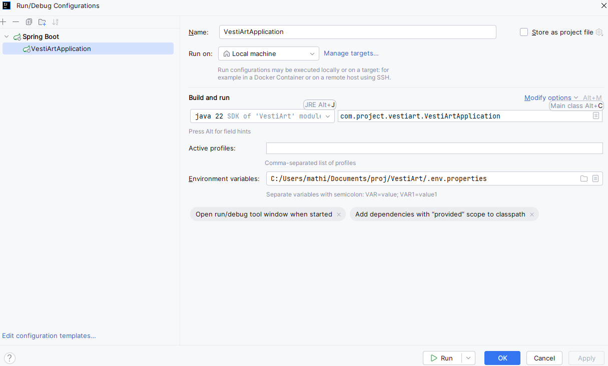

# VestIArt

Ce projet a pour but de réaliser une API qui communique avec OpenAI pour générer du contenu et un Bucket afin de stocker les documents crées.

## Installation

### Prérequis

Pour travailler / utiliser ce projet, nous vous recommandons :

* Un outil de testing API (*Exemple : Bruno - https://www.usebruno.com/downloads*)
* Un JDK pour Java (*Version recommandée : 21 - Si ce n'est pas le cas, cliquez-ici :https://jdk.java.net/archive*)
* Une connexion internet stable
* Maven (Si ce n'est pas le cas, vous pouvez l'installer via Chocolatey
```bash
choco install maven
```
Ou sinon cliquez-ici : https://maven.apache.org/install.html)

### Fichier d'Environnement

Pour exécuter l'application, il faut d'abord créer votre fichier d'environnement qui sera nommé de la sorte : *.env.properties*

Voici un exemple du contenu

```
DATABASE_URL=jdbc:votre_url_de_db
DATABASE_USER=votre_user
DATABASE_PASSWORD=votre_password
OPENAI_KEY=votre_key_openai
BUCKET_KEY=votre_bucket_key
JWT_SECRET_KEY=NzYzMjM2NTMxNzYxNDQ1MjA2NTgxNzI1Njk0MTUzNjU1NjU5Njk2ODcyNjMzNzU1MTYxNjE3OTUzNTM3NzU3
```

Ces informations permettent donc de :
* Communiquer avec votre base de données (*Stocker les créations, les utilisateurs, etc.*)
* Requêter OpenAI pour générer du texte ainsi qu'une image
* Stocker le PDF généré dans le Bucket
* La clé utilisé pour générer un token d'authentification

### Commandes d'installation

Une fois ce document crée, vous pouvez donc réaliser un

```bash
.\mvnw clean install -DskipTests
```

Cela va vous installer les dépendances associées au projet.

Une fois que le build est terminé, vous serez dans la capacité de lancer le projet.

Pour cela, deux possibilités :

* La première est de lancer via maven :
```bash
.\mvnw spring-boot:run
```

* La deuxième option est de lancer l'application via votre IDE de prédilection (Ex : IntelliJ)

Voici un exemple de configuration de lancement :


